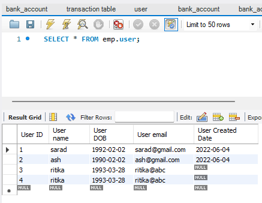
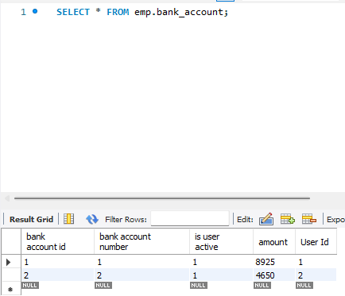
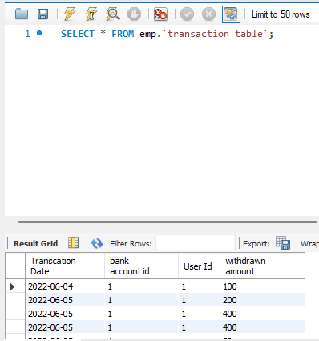
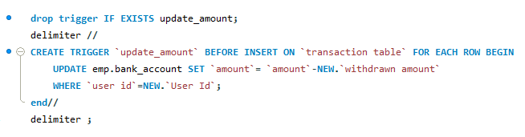
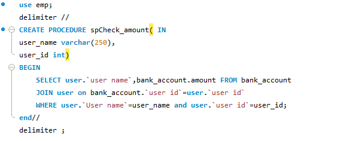
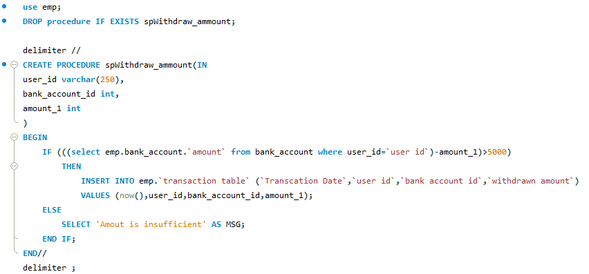
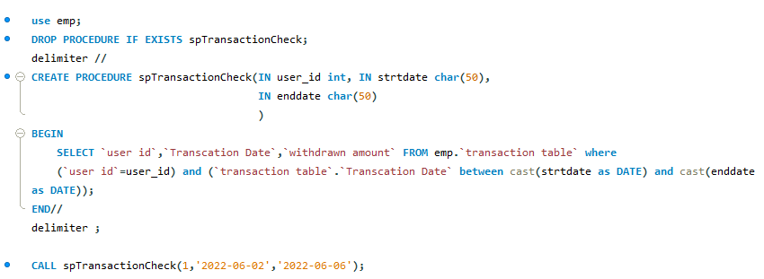

# SQL_PYTHON_store_procedure
##Create a console application using python and sql.
###Description:
```
1. Create a stored procedure to check the account balance.
2. Create a stored procedure to withdraw the amount.
  a. User must have a sufficient amount to withdraw money from his/her
  account.
  b. Minimum balance 5000 rupees must be maintained in each user account.
3. Check account statement: Users should be able to check all transactions for
a given interval of time.(From date and To date)


###Table Structure
~~~
1. User Table(User Id, User name, User dob,User email, User created date )
2. Bank_Account Table ( User Id, bank account id, bank account number, is
user active, amount )
3. Transaction Table ( Transaction date, User Id, Bank A/C id, withdrawn
amount )
Note: If tasks 1, 2, and 3 are done, now create a console for a Python
application.
~~~
###Implement below functionality using python.
~~~
1. Invoke stored procedure using python script.
2. Insert record using python script.
3. Use OOPs to design python programs to implement all functionality
mentioned above.
~~~
```
#SOLUTION:
INITIALLY CREATED TABLE and STORE PROCEDURE 
The store procedure also need trigger for better performance.
One trigger is used to update the amount in bank_table based on insert in transaction table
```
Following are the snip of tables
user table :
```


```
bank_Account table:
```

```
transaction table:
```


```buildoutcfg
Create trigger to check weather amount is less than 5000 after transaction or not
```

```buildoutcfg
Store procedure to check balance
```

```buildoutcfg
Store procedure to withdraw amount
```

```buildoutcfg
Store procedure to check transaction for a range of date
```
